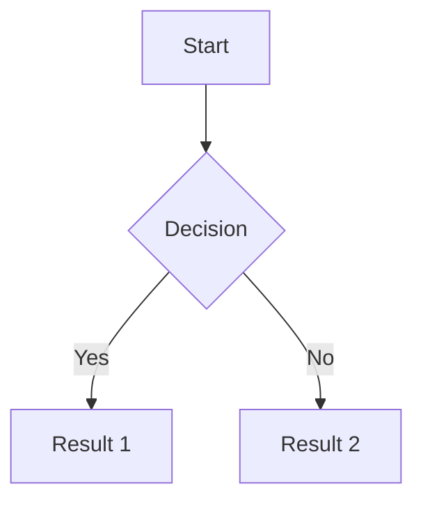
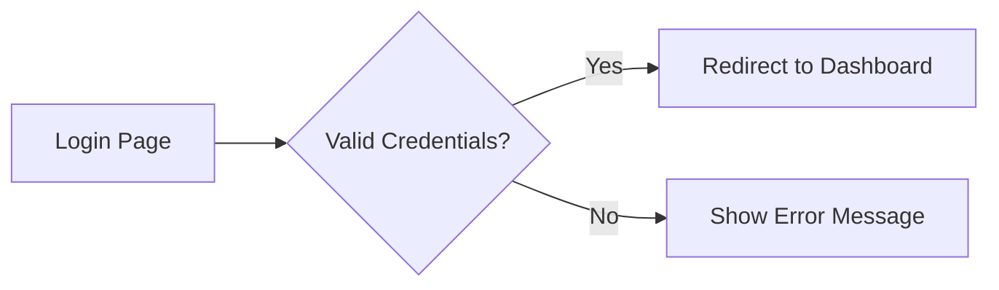
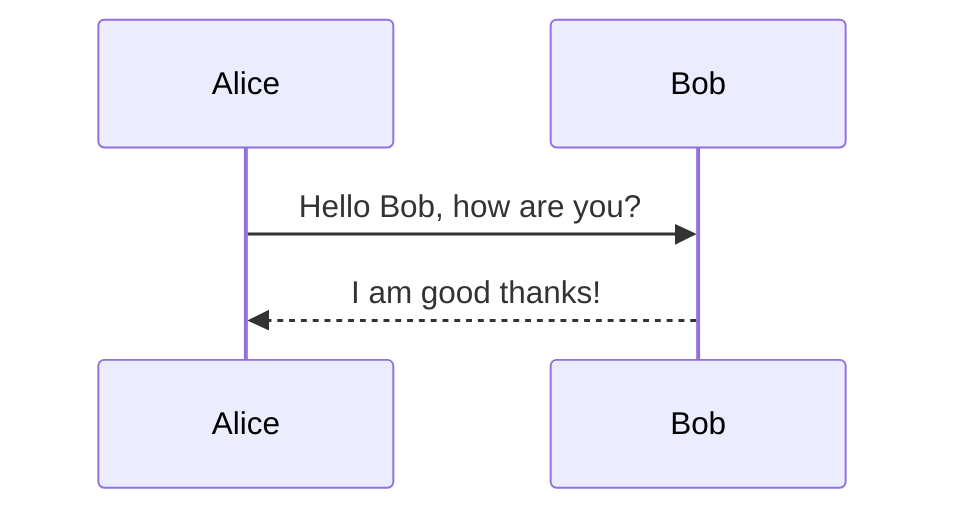
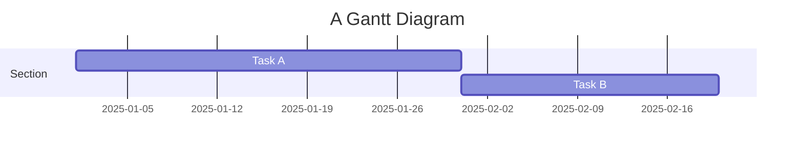
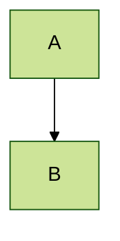

# Mermaid - Diagramming and charting tool

###### Source: [ChatGPT](https://chatgpt.com/)

JavaScript based diagramming and charting tool that renders Markdown-inspired text definitions to create and modify diagrams dynamically. A syntax extension for markdown that allows you to create diagrams and visualizations using a simple, text-based scripting language called **Mermaid**. It is especially popular for embedding charts and diagrams directly in markdown documents, like those used in documentation, wikis, and dev notes.

## 🔍 Overview

* **Language**: Mermaid is a **domain-specific language (DSL)** for generating diagrams.
* **Integration**: Commonly integrated into platforms like **GitHub**, **GitLab**, **Obsidian**, **Notion**, and static site generators like **MkDocs** and **Docusaurus**.
* **Use Case**: Instead of drawing diagrams manually, you describe them with code inside a markdown block, and they are rendered visually.

## 🛠️ Syntax Basics

Mermaid syntax is included in markdown using a fenced code block:

<pre>

</pre>

This will render a flowchart with a decision tree.

## 🧩 Supported Diagram Types

Mermaid supports many diagram types:

| Type                        | Keyword              | Example                        |
| --------------------------- | -------------------- | ------------------------------ |
| Flowchart                   | `graph`              | `graph TD` (Top-Down)          |
| Sequence Diagram            | `sequenceDiagram`    | Participants and message flows |
| Gantt Chart                 | `gantt`              | Project planning timelines     |
| Class Diagram               | `classDiagram`       | UML-style relationships        |
| State Diagram               | `stateDiagram`       | Finite states                  |
| Entity Relationship Diagram | `erDiagram`          | Database schema                |
| Journey Map                 | `journey`            | UX flow mapping                |
| Pie Chart                   | `pie`                | Percent-based data             |
| Requirement Diagram         | `requirementDiagram` | System engineering             |
| Git Graph                   | `gitGraph`           | Commit history                 |
| Mindmap (experimental)      | `mindmap`            | Brainstorming                  |
| Timeline (experimental)     | `timeline`           | Chronological events           |

## ✅ Example: Flowchart

## ✅ Example: Sequence Diagram

## ✅ Example: Gantt Chart

## 🔧 Configuration & Theming

* **Themes**: Default, dark, forest, neutral.
* **Custom Styling**: Via `%%{init: {'theme': 'dark'}}%%`.
* **Rendering Options**:

  * `startOnLoad`
  * `themeVariables` for CSS-like styling

Example:

## 📦 Integration Environments

| Platform   | Mermaid Support                                  |
| ---------- | ------------------------------------------------ |
| GitHub     | ✅ (in markdown previews as of 2022)              |
| GitLab     | ✅                                                |
| Obsidian   | ✅ (native and plugin-enhanced)                   |
| Notion     | ⚠️ Not native, but can embed via iframe          |
| VS Code    | ✅ (Markdown Preview Mermaid Support extension)   |
| MkDocs     | ✅ (with `pymdownx.superfences`)                  |
| Docusaurus | ✅ (via plugins like `@docusaurus/theme-mermaid`) |

## 🧠 Tips & Gotchas

* **Comments**: Use `%%` for line comments.
* **Escaping**: Sometimes special characters (like `<`, `>`, `:`) need escaping in specific contexts.
* **Responsive Layout**: Mermaid doesn’t automatically scale for mobile—wrap it in a container with CSS if needed.
* **Live Editor**: Use the [Mermaid Live Editor](https://mermaid.live/) to try diagrams interactively.

## 📚 Learning Resources

* [Official Website & Docs](https://mermaid.js.org/)
* [Mermaid Live Editor](https://mermaid.live/)
* [GitHub Docs on Mermaid](https://docs.github.com/en/get-started/writing-on-github/working-with-advanced-formatting/creating-diagrams)
